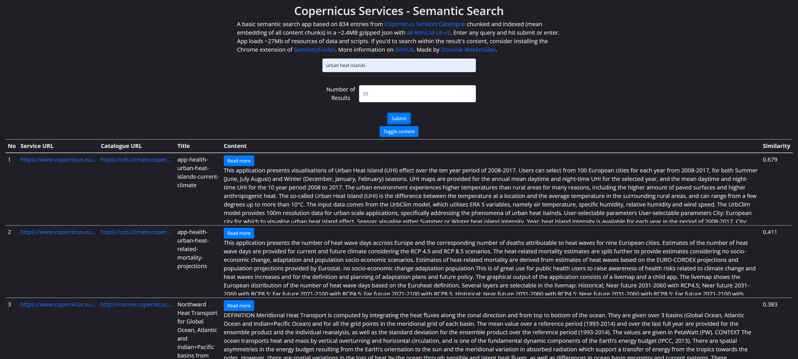
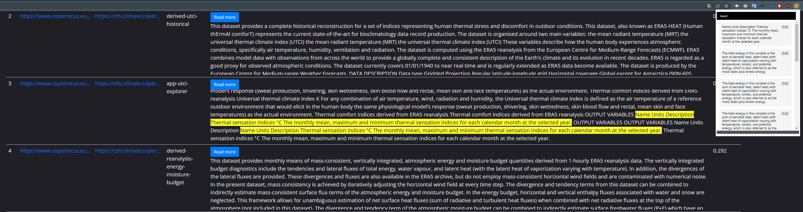
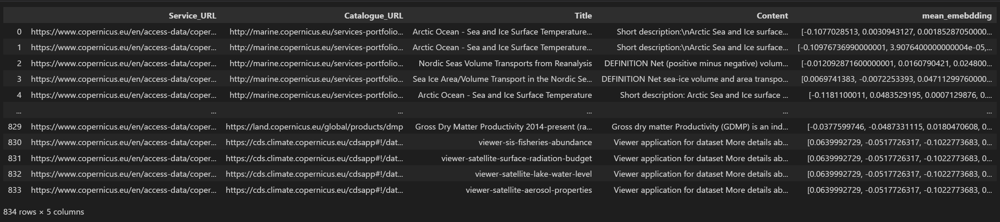

# Copernicus Services Semantic Search

## [App here](https://do-me.github.io/copernicus-services-semantic-search/)

## [Tutorial here](https://geo.rocks/post/semantic-search-tutorial/) with lots of tips

A basic semantic search app based on 834 entries from [Copernicus Services Catalogue](https://www.copernicus.eu/en/accessing-data-where-and-how/copernicus-services-catalogue) chunked and indexed (mean embedding of all content chunks) in a ~2.4MB gzipped json with [all-MiniLM-L6-v2](https://huggingface.co/sentence-transformers/all-MiniLM-L6-v2). Enter any query and hit submit or enter. App loads ~27Mb of resources of data and scripts. The ML model runs entirely in the browser thanks to [transformers.js](https://github.com/xenova/transformers.js).



## Advanced search 

If you'd like to search within the result's content, consider installing the Chrome extension of [SemanticFinder](https://chrome.google.com/webstore/detail/semanticfinder/ddmgffoffelnhnonpoiblaoboaeieejl), [GitHub repo](https://github.com/do-me/SemanticFinder).



It finds the most relevant sections to your query in the actual content of the results by performing semantic search on the fly.

## Data mining tutorial 

The process of creating the data dump includingcan be repeated with the included [Jupyter Notebook](copernicus_services_miner.ipynb). It includes the whole processing pipeline:
- data mining with requests and beautifulsoup
- preprocessing in pandas
- chunking the document text in smaller paragraphs of the right size for the ML model
- creating embeddings for each chunk
- calculating the mean embedding for each document
- saving as gzipped json (small file size & easy and fast to read in js with pako.js)

You can re-run the process for updates (if you do so, please open a pull request for this repo or write so I can keep the data dump updated) or use other indexing models like the current [MTEB](https://huggingface.co/spaces/mteb/leaderboard) leaders of the bge or gte family. You could also use a multilingual model to perform search queries in other languages than English. The current dump holds 834 entries from 21 October 2023. 



## Export all 834 entries for large LLM context 
- Run a search and display all results (enter 1000 as limit)
- Open the browser console with F12
- Use this JS and execute it: 

```javascript
function tableToText() {
            // Select the table
            const table = document.getElementById('results-table');
            let resultText = '';

            // Loop through each row
            for (let row of table.rows) {
                // Loop through each cell in the row, excluding the "Similarity" column (index 2)
                for (let i = 0; i < row.cells.length; i++) {
                    if (i === 5) continue; // Skip Similarity

                    const cell = row.cells[i];

                    // For the first two columns, check if there are anchor tags
                    if (i === 1) {
                        const link = cell.querySelector('a');
                        if (link) {
                            // Use the href attribute of the anchor tag
                            resultText += link.href + '\n';
                        } else {
                            resultText += cell.innerText + '\n';  // Fallback to normal text
                        }
                    } else {
                        resultText += cell.innerText + '\n';  // For other columns, use innerText
                    }
                }
                resultText += '\n\n';  // Add two line breaks between rows
            }

            console.log(resultText);  // Log the result to the console
        }

// Call the function to convert table to text and log it
tableToText();
```
- Copy the output with the copy button (e.g. in Chrome or select the whole text)

- In Gemini (https://aistudio.google.com), this text counts roughly 1.5 Mio tokens, so you can still add large prompts within the 2 Mio context window

If you like this project, ⭐ the repo or give a shoutout on social media!
